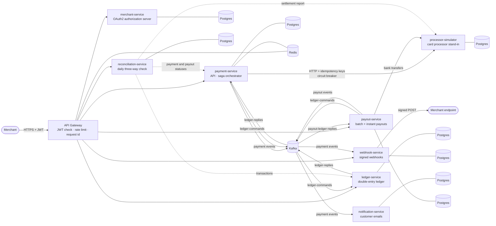

# PayFlow: a distributed payments engine

PayFlow is a card-payments backend built as nine Spring Boot microservices. Merchants
authenticate with OAuth2, take payments that are authorized and captured against a card
processor and booked in a double-entry ledger, issue refunds, get paid out to their bank
account, and receive signed webhooks. A payment, a refund and a payout each span several services
and an external party, so each runs as an **orchestrated saga** with compensation. Every hop is idempotent, and every message goes through a transactional
outbox. Every night, the processor's records, the ledger and the payment statuses are reconciled
against each other. The system runs on Kubernetes behind an API gateway, with metrics, alerting,
dashboards and one distributed trace per payment.



Every service owns its database, and services share no tables (eight logical databases; the local
cluster runs them in one Postgres instance to save memory). Kafka carries events and saga
commands; every message is written to an outbox in the same transaction as the change that
caused it. A full walkthrough is in **[docs/ARCHITECTURE.md](docs/ARCHITECTURE.md)**.

## Highlights

| | |
|---|---|
| **Saga orchestration** | Payment (authorize → capture → settle) and refund (hold → refund → finalize) sagas run on a pure, unit-tested state machine. Failures before the capture are compensated; after it, steps are only retried; an unknown capture outcome is never guessed at. [SAGA.md](docs/SAGA.md) |
| **Exactly-once effects over at-least-once delivery** | Transactional outbox on both sides of Kafka, idempotency keys on every processor call, deduplicated consumers, and a reversal-by-key that cancels an authorization whose answer was lost |
| **Double-entry ledger** | Settlements, refunds and payouts as balanced postings, with holds that are released or finalized; a row lock stops a refund and a payout (or two refunds) from spending one balance |
| **Merchant payouts** | A daily batch and instant payouts, each a saga: hold the payable balance (only money settled long enough ago), transfer at an asynchronous bank, finalize, or release on failure; a paid payout can still be returned and is booked back. Idempotency keys end to end, payout webhooks, reconciled daily. [PAYOUTS.md](docs/PAYOUTS.md) |
| **Resilience** | Circuit breaker on the processor, retries with backoff and jitter, leases with `FOR UPDATE SKIP LOCKED` so replicas share work, retries for idempotent requests at the gateway, consumer error classification, dead-letter topics |
| **Security** | OAuth2 client credentials with RS256 JWTs (own authorization server), scopes and per-merchant data ownership, edge validation at the gateway plus validation in each service, per-merchant rate limiting, HMAC-signed webhooks with SSRF protection |
| **Kubernetes** | Kustomize, 2 replicas per service, autoscaling, PodDisruptionBudgets, readiness/liveness/startup probes, graceful shutdown, zero-downtime rolling updates, non-root read-only containers, priority classes |
| **Daily reconciliation** | A scheduled job compares the processor's settlement report (card payments and payout transfers), the ledger and payment-service's and payout-service's statuses through their APIs, reports 19 kinds of discrepancy, and alerts until each day is clean. One run per day across replicas (ShedLock). [RECONCILIATION.md](docs/RECONCILIATION.md) |
| **Observability and alerting** | Prometheus (pod discovery), a provisioned Grafana dashboard, one Jaeger trace per payment across all services, and alert rules (unit-tested with promtool) routed by Alertmanager: stuck sagas, outbox backlog, consumer lag, open circuit breaker, services down |
| **Verification** | 433 automated tests (Testcontainers with Postgres, Kafka and Redis), CI on every push, and fault injection on a live cluster: processor outage, ledger down, Kafka down, pods killed mid-saga; every alert in those scenarios fired and resolved, and the daily reconciliation found injected corruption and nothing else |

## Services

| Service | Port | Responsibility |
|---|---|---|
| [api-gateway](api-gateway) | 8085 (80 in cluster) | Single public entry: JWT validation, per-merchant rate limiting (Redis), request ids, routing, retries for idempotent requests |
| [merchant-service](merchant-service) | 8084 | OAuth2 authorization server (Spring Authorization Server): merchant onboarding, client credentials, JWKS, operator admin API |
| [payment-service](payment-service) | 8080 | Payments API, idempotent creation, saga orchestrator, outbox relay |
| [processor-simulator](processor-simulator) | 8086 | Stand-in for an external card processor: authorize / capture / void / refund / reversal, idempotency keys, test cards, fault injection |
| [ledger-service](ledger-service) | 8082 | Double-entry ledger driven by saga commands; balances and transaction history |
| [webhook-service](webhook-service) | 8083 | Merchant webhook subscriptions and signed, retried, deduplicated delivery |
| [notification-service](notification-service) | 8081 | Customer notifications (email channel, stubbed) with retries and a dead-letter topic |
| [reconciliation-service](reconciliation-service) | 8087 | Daily three-way reconciliation of processor, ledger and payments (and of bank, ledger and payouts); run history and operator API |
| [payout-service](payout-service) | 8088 | Merchant payouts: payout destinations, the daily batch, instant payouts, the payout saga |

## Tech stack

Java 21 · Spring Boot 3.5 · Spring Security / Authorization Server · Spring Cloud Gateway ·
Spring Kafka · PostgreSQL 17 + Flyway · Apache Kafka 4 (KRaft) · Redis 7 · Resilience4j ·
Micrometer + OpenTelemetry · Prometheus + Alertmanager · Grafana · Jaeger · ShedLock · Docker ·
Kubernetes + Kustomize ·
GitHub Actions · JUnit 5 · Testcontainers · Awaitility

## Run it

**On Kubernetes** (Docker Desktop with Kubernetes enabled):

```bash
scripts/k8s-up.sh      # builds 8 images, generates local secrets, deploys, waits until ready
```

Everything is then served at `http://localhost`. Grafana is at `:3000`, Prometheus at `:9090`,
Alertmanager at `:9093` and Jaeger at `:16686`. [docs/DEPLOYMENT.md](docs/DEPLOYMENT.md) walks through a first payment
with `curl`.

**Tests:** each module is a standalone Maven project; `mvn verify` runs its unit and
Testcontainers tests (Docker required).

```bash
cd payment-service && mvn verify
```

## A payment, end to end

```bash
# operator token -> onboard a merchant (returns a client id + secret, shown once)
ADMIN=$(curl -s -u "payflow-admin:$ADMIN_SECRET" -d grant_type=client_credentials http://localhost/oauth2/token | jq -r .access_token)
curl -s -X POST http://localhost/api/v1/merchants -H "Authorization: Bearer $ADMIN" \
  -H 'Content-Type: application/json' -d '{"name":"Acme","email":"ops@acme.example"}'

# merchant token -> pay with a test card
TOKEN=$(curl -s -u "$CLIENT_ID:$CLIENT_SECRET" -d grant_type=client_credentials http://localhost/oauth2/token | jq -r .access_token)
curl -s -X POST http://localhost/api/v1/payments -H "Authorization: Bearer $TOKEN" \
  -H 'Idempotency-Key: order-1001' -H 'Content-Type: application/json' \
  -d '{"amount":25.00,"currency":"USD","paymentMethod":"pm_card_visa"}'
# -> 201 {"status":"PROCESSING", ...}; about 2 seconds later GET shows SUCCESS and the ledger balance is 25.00
```

Test cards such as `pm_card_declined`, `pm_card_capture_fails`, `pm_card_refund_fails` and
`pm_card_timeout_once` exercise each failure path.

## Documentation

| Document | |
|---|---|
| [ARCHITECTURE.md](docs/ARCHITECTURE.md) | How the system fits together: services, data, messaging, consistency, security, deployment |
| [DECISIONS.md](docs/DECISIONS.md) | The main design decisions, why, and what they cost |
| [SAGA.md](docs/SAGA.md) | Payment and refund sagas, compensation, idempotency, processor and ledger protocols |
| [MERCHANT_AUTH.md](docs/MERCHANT_AUTH.md) | OAuth2, tokens, scopes, credential lifecycle |
| [WEBHOOK_SERVICE.md](docs/WEBHOOK_SERVICE.md) | Webhook contract, signing, retries, SSRF protection |
| [PAYOUTS.md](docs/PAYOUTS.md) | Merchant payouts: funds availability, the payout saga, the bank, batch and instant payouts, runbook |
| [RECONCILIATION.md](docs/RECONCILIATION.md) | Daily reconciliation: what is compared, discrepancy types, scheduling, runbook |
| [DEPLOYMENT.md](docs/DEPLOYMENT.md) | Kubernetes, gateway, alerting and runbooks, CI, cluster verification |
| [INTERVIEW_NOTES.md](docs/INTERVIEW_NOTES.md) | Talking points and trade-offs, question by question |

## Status and limits

All planned phases are built and verified: webhooks, merchant identity and auth, Kubernetes with
an API gateway, sagas, alerting with daily reconciliation, and merchant payouts. Known limits,
stated plainly:
- single-node local deployment: one Kafka broker and one Postgres instance;
- the email channel is a stub;
- the bank and the card processor are simulators (test tokens, no real money or card data);
- no fees, FX or negative balances: payouts only pay what is there.

See [docs/PROJECT_STATE.md](docs/PROJECT_STATE.md) for what's next.
