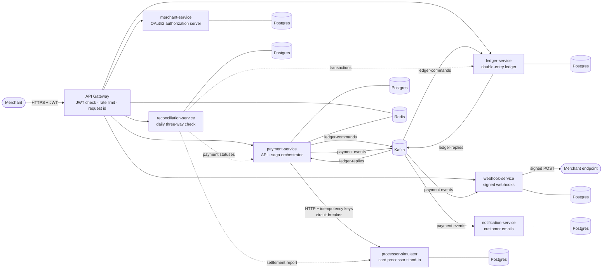

# Architecture

PayFlow takes card payments for merchants:
- it authorizes and captures them against a card processor;
- it books them in a double-entry ledger;
- it refunds them;
- it tells merchants (webhooks) and customers (notifications) what happened;
- every night, it checks its books against the processor's.

The design goal is **correct money movement under failure**. Any request, message, pod or
dependency can fail or repeat at any point, and no payment may be charged twice, booked twice,
lost, or left holding a customer's funds.

This document shows how the parts fit together. The per-topic documents linked at the end go
deeper.

## The system

| Service | Owns | Talks to | Reached through |
|---|---|---|---|
| **api-gateway** | Rate-limit buckets (Redis) | every public service; merchant-service's JWKS | the only public entry (`http://localhost` in the cluster) |
| **merchant-service** | merchants, credentials (bcrypt), signing key | — | gateway: `/oauth2/**`, `/api/v1/merchants/**` |
| **payment-service** | payments, sagas and their step history, outbox | processor (HTTP), ledger (Kafka), Redis (idempotency cache) | gateway: `/api/v1/payments/**` |
| **processor-simulator** | authorizations, refunds, idempotency records | — | internal only (API key) |
| **ledger-service** | accounts, transactions, entries, processed commands, outbox | payment-service (Kafka replies) | gateway: `/api/v1/ledger/**` |
| **webhook-service** | subscriptions (with signing secrets), deliveries, attempts | merchant endpoints (HTTPS) | gateway: `/api/v1/webhooks/**` |
| **notification-service** | notifications, delivery attempts | email channel (stub) | no API |
| **reconciliation-service** | reconciliation runs and discrepancies, scheduler lock | processor (report), ledger and payment-service (read-only APIs, its own OAuth2 client) | gateway: `/api/v1/reconciliation/**` |

Each service has its own database and user; nothing reads another service's tables. Locally,
the seven databases share one Postgres instance to save memory; in production each would be its
own managed instance. Redis holds only data that can be lost: rate-limit buckets, and an
idempotency cache backed by the database.

## How a payment flows

1. **Authenticate.** The merchant's server exchanges its client id and secret for a 15-minute
   RS256 JWT at `POST /oauth2/token` (OAuth2 client credentials). The token carries the
   `merchant_id` and the merchant's scopes.
2. **Edge.** The gateway checks the token's signature, expiry, issuer and audience against
   merchant-service's public keys (cached). It then applies the merchant's rate limit (a token
   bucket in Redis, shared by all gateway replicas), stamps an `X-Request-Id`, and routes the
   request.
3. **Create.** payment-service validates the token again, plus the `payments:write` scope.
   It deduplicates on the merchant's `Idempotency-Key` (Redis cache, with the database as the
   authority), then in **one transaction** inserts the payment (`PROCESSING`), its saga, and a
   `PAYMENT_CREATED` outbox row. It answers `201` straight away.
4. **Authorize and capture.** The saga worker (on any replica) claims the saga with `FOR UPDATE
   SKIP LOCKED` and a lease, then calls the processor with idempotency key `<sagaId>:authorize`,
   then `<sagaId>:capture`. A lost answer is retried with the same key, and the processor
   replays its original response. A circuit breaker stops calls while the processor is failing.
5. **Settle.** The saga writes a `SETTLE_PAYMENT` command to its outbox. The relay publishes it
   to `ledger-commands`. The ledger posts debit platform-clearing / credit merchant, records the
   command as processed, and writes its reply to its own outbox, all in one transaction. The
   reply returns on `ledger-replies`.
6. **Complete.** On the reply, the saga marks the payment `SUCCESS` and writes
   `PAYMENT_COMPLETED` to the outbox.
7. **Fan out.** webhook-service delivers a signed `PAYMENT_COMPLETED` webhook to the merchant,
   retrying with backoff. notification-service emails the customer.

If a step fails, the saga compensates or retries according to where it is relative to the
capture, the point where money actually moves (see [Consistency](#consistency)). Refunds run the
same way: the ledger holds the amount from the merchant's balance, the processor refunds, and
the ledger finalizes. If the processor refuses, the hold is released.

All of the above is **one trace** in Jaeger. The trace context is stored on the saga and on
every outbox row and continued wherever the work resumes.

## Messaging

| Topic | Producer | Consumers | Key | Carries |
|---|---|---|---|---|
| `payment-created` | payment-service | webhook-service, notification-service | payment id | Payment events: CREATED, AUTHORIZED, COMPLETED, FAILED, CANCELLED, REFUNDED, REFUND_FAILED |
| `ledger-commands` | payment-service | ledger-service | payment id | SETTLE_PAYMENT, HOLD_REFUND, RELEASE_HOLD, FINALIZE_REFUND |
| `ledger-replies` | ledger-service | payment-service | payment id | SUCCEEDED / REJECTED with a reason |
| `*.DLT` | each consumer's error handler | operators | as source | Messages that can never be processed |
| `webhook-deliveries.DLT`, `notification-events.DLT` | webhook / notification | operators | — | Deliveries that failed for good |

- **Uniform messages.** Every message is `{eventId, eventType, occurredAt, data}` with exact
  decimal amounts.
- **Ordering.** Topics have 3 partitions and are keyed by payment id, so one payment's messages
  stay in order. The outbox relays also hold a payment's later messages back until its earlier
  ones have been published.
- **Ownership.** Topics are declared by the service that owns them.

## Consistency

Every message can be lost before it is sent or delivered more than once, and every call can time
out after it took effect. The system is built so that none of this changes the outcome.

| Mechanism | Where | What it guarantees |
|---|---|---|
| **Transactional outbox** | payment-service, ledger-service, webhook DLT relay | State change and message commit together: no message for a rolled-back change, no change without its message |
| **Idempotent consumers** | ledger (`processed_commands`), webhook and notification (`processed_events`) | A message delivered twice takes effect once; a repeated ledger command gets its original reply again |
| **Idempotency keys** | merchant → payment API; saga → processor | A retried request returns the first result. The processor stores responses per key and rejects a key reused with a different body |
| **Reversal by key** | saga → processor | An authorization whose answer was lost can be cancelled whether it was processed or not; if it arrives late, it is rejected |
| **Orchestrated saga** | payment-service | Steps before the capture are compensated (void, release hold); steps after it are retried; an unknown capture outcome is parked for an operator, never guessed |
| **Claims and leases** | saga worker, outbox relays, webhook and notification dispatchers | `FOR UPDATE SKIP LOCKED` plus a lease and an attempt or version check: any number of replicas share the work, and a result from a worker whose lease ran out is discarded |
| **Business-key guards** | ledger | A payment is settled at most once even under a different command id; a release or finalize needs this saga's open hold |
| **Row locks for money** | ledger holds, processor authorizations | Two concurrent refunds can't spend the same balance; two captures can't both succeed |

This was checked on the live cluster by reconciling every payment across the payment, processor
and ledger databases after outages and pod kills. All three agreed every time (see
[SAGA.md](SAGA.md#cluster-verification)). That check now runs **every day** in production form:
reconciliation-service reads the processor's settlement report, the ledger's transactions and
payment-service's statuses through APIs (never their databases), reports each disagreement by
type, and alerts until the day is clean ([RECONCILIATION.md](RECONCILIATION.md)).

## Failure handling

| Failure | Handling |
|---|---|
| Processor slow or down | Timeouts (connect 1s, read 5s), retry with the same key and backoff with jitter, circuit breaker. Authorization gives up after 2 min and reverses the authorization; capture never gives up on its own |
| Ledger down | Commands wait in Kafka; the saga re-sends an overdue command (same id) with backoff |
| Database or Kafka down in a consumer | Infrastructure errors are retried until they pass, holding the partition (no message is skipped); malformed messages go to the DLT at once; other errors get a few retries, then the DLT |
| Pod killed mid-work | Its leases expire and another replica repeats the step under the same idempotency key. The gateway retries GETs on another pod |
| Merchant endpoint failing | Webhook retries with exponential backoff (5 attempts, up to 8 min apart), then DLT; SSRF guard on subscription URLs |
| Something that must never happen | Parked with a reason (`REQUIRES_ATTENTION`), counted by a gauge, and resumable through an operator endpoint |

## Security

- **Identity.** merchant-service is an OAuth2 authorization server (Spring Authorization
  Server). Merchants use client credentials; client secrets are stored as bcrypt hashes and shown
  once. Tokens are RS256 JWTs. Every replica signs with the same key, mounted from a Kubernetes
  Secret.
- **Authorization.** Scopes per endpoint: `payments:write/read`, `ledger:read`,
  `webhooks:manage`, plus operator scopes. The merchant always comes from the token, never from
  the request, and another merchant's resources are reported as not found.
- **Defense in depth.** The gateway rejects forged or expired tokens before routing, and each
  service validates the token again and enforces its own rules. Tokens validate even while
  merchant-service is down, because the keys are cached.
- **Abuse.** Per-merchant token-bucket rate limiting at the gateway. Anonymous callers are keyed
  by peer address, never by `X-Forwarded-For`.
- **Outbound.** Webhooks are signed with HMAC-SHA256 over the timestamp and body. Subscription
  URLs must be HTTPS and must not point at private or internal addresses (SSRF protection).
- **Runtime.** Non-root, read-only containers with all capabilities dropped. Secrets come from
  Kubernetes Secrets, generated locally and never committed. Prometheus has a namespace-scoped
  role only.

## Deployment

- **Kubernetes manifests.** Kustomize base plus a local overlay.
- **Replicas and autoscaling.** Two replicas of every service, with CPU autoscaling for the
  gateway and payment-service.
- **Probes and shutdown.** Startup, readiness and liveness probes; liveness never depends on a
  dependency's health. A preStop delay plus graceful shutdown means a rolling restart drops no
  requests.
- **Availability during disruption.** PodDisruptionBudgets for every service, and a priority
  class so Postgres, Kafka and Redis are always scheduled first.
- **Infrastructure in the cluster.** Postgres, Kafka in KRaft mode, Redis, Prometheus,
  Alertmanager, Grafana, Jaeger and a Kafka exporter.
- **CI on every push and pull request.** GitHub Actions runs all eight test suites, builds the
  images, unit-tests the alert rules, checks the Alertmanager configuration, and validates the
  rendered manifests against the Kubernetes API schemas.

## Observability

- **Metrics:** each service exposes Prometheus metrics, and Prometheus finds the pods itself.
  Business and saga metrics include payments by status, sagas by outcome, saga duration,
  processor calls by outcome, circuit-breaker state, parked sagas, ledger commands, webhook and
  notification delivery, outbox backlog and age, the oldest running saga step, and reconciliation
  results. Consumer lag comes from a Kafka exporter, so it shows even when every consumer is dead.
- **Alerting:** Prometheus rules for stuck or parked sagas, outbox backlog, consumer lag, dead
  letters, an open circuit breaker, services or replicas down, gateway errors and reconciliation.
  Every rule is unit-tested with `promtool`. Alertmanager groups them, suppresses a service's
  warnings while the whole service is down, and delivers them to an in-cluster receiver, or Slack
  when a webhook URL is configured. Each alert links a runbook
  ([DEPLOYMENT.md](DEPLOYMENT.md#alerting)).
- **Dashboard:** one provisioned Grafana dashboard.
- **Traces:** one Jaeger trace per payment, from the API call through every service and Kafka hop.

## Testing

| Layer | What it shows |
|---|---|
| Unit | State-machine rules (29 tests: every transition, compensation and timeout), parsers, policies, idempotency fingerprints |
| Integration (Testcontainers) | Real Postgres, Kafka and Redis: the saga against a stub processor and a stub ledger (15 scenarios), ledger concurrency, the processor's idempotency under 8 concurrent duplicates, the authorization server, the gateway in front of a real upstream |
| Live cluster | Every test card end to end; processor outage under load; ledger scaled to zero; pods force-killed; rolling restarts under traffic; autoscaling under load; a reconciliation of every payment across three databases; a simulated incident in which each alert fired and resolved; injected corruption caught by the daily reconciliation |

359 automated tests run in CI, along with the alert-rule tests. Results of the cluster runs are
recorded in [DEPLOYMENT.md](DEPLOYMENT.md#testing), [SAGA.md](SAGA.md#cluster-verification),
[DEPLOYMENT.md](DEPLOYMENT.md#verified-on-the-cluster) (alerts) and
[RECONCILIATION.md](RECONCILIATION.md#on-the-cluster).

## Read more

- [DECISIONS.md](DECISIONS.md): the main design decisions and their trade-offs
- [SAGA.md](SAGA.md): sagas, compensation, processor and ledger protocols
- [MERCHANT_AUTH.md](MERCHANT_AUTH.md): authentication and authorization
- [WEBHOOK_SERVICE.md](WEBHOOK_SERVICE.md): webhook delivery
- [RECONCILIATION.md](RECONCILIATION.md): the daily reconciliation
- [DEPLOYMENT.md](DEPLOYMENT.md): Kubernetes, gateway, alerting and CI
